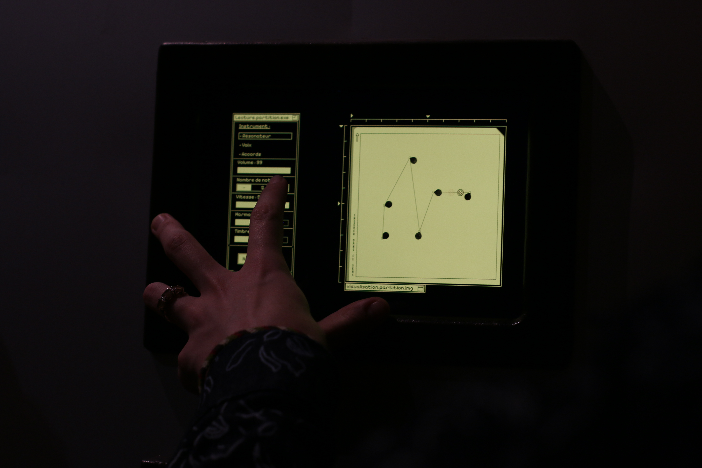

"Orgue de barbarie" is an interactive musical instrument, created for the Morfosonic exhibition at the José Cabanis Médiathèque in Toulouse.

The instrument is made up of a Microsoft Surface Go running Linux Mint, a Brother DS-640 scanner, and a pair of bookshelf speakers in a custom enclosure.

A vanilla HTML/CSS/Javascript webpage interface with a few parameters is connected to a Python Flask server. The Python Flask server makes system calls to scan a new image when requested. The image is analysed for points (OpenCV Shi-Tomasi corner detection). The points info is sent to the webpage, which displays the image and draws segments between the points, from left to right. A playhead follows the segments, playing a note at each new point. Note duration and pitch are determined by each segments length and angle. MIDI notes are sent to a Pure Data patch, which uses the Mutable Intruments Plaits oscillator models for sound synthesis.

Parameters include volume (with automatic cutoff after 30 seconds idling), oscillator model selection, number of notes (within limit of corners detected), play speed, and two oscillator timbre parameters (sent by MIDI CC).

